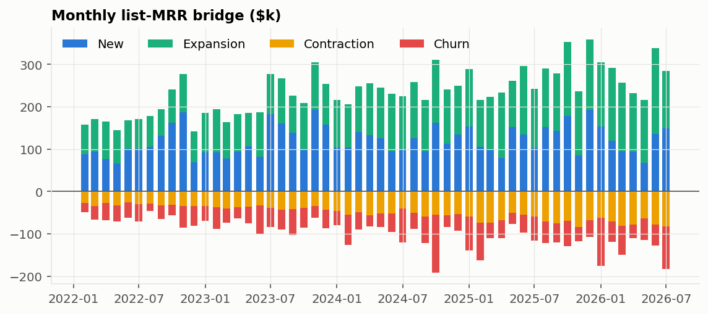
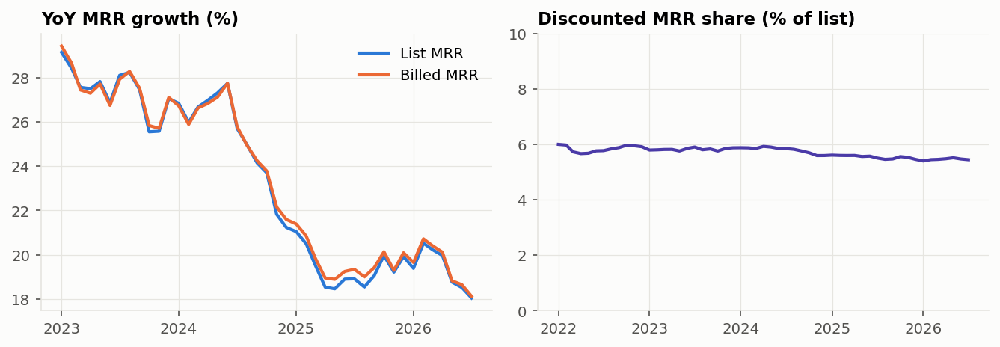
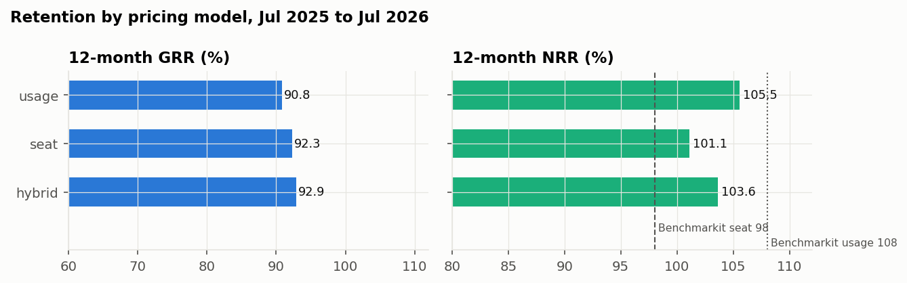
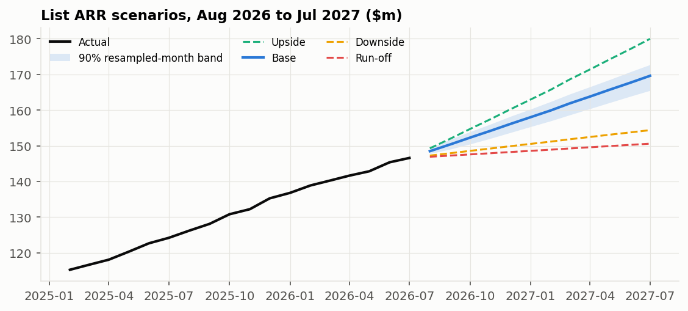

<div align="center">

# B2B SaaS Growth Quality and Churn Risk

A buy-side case study: underwriting a $113m-ARR software acquisition, testing that underwriting against nineteen
months of post-close results, and deciding where to spend retention effort.

[Full report](reports/project_report.docx) · [Quality-of-revenue workbook (Excel)](reports/quality_of_revenue.xlsx) · [Investment committee brief (PDF)](reports/portfolio_monitoring_brief.pdf) · [Dashboard](dashboard/index.html)

</div>

---

## The situation

A formerly bootstrapped B2B software company selling to SMB, Mid-Market and Enterprise customers is acquired in
December 2024 at $113m of annual recurring revenue (ARR). By July 2026 it has grown to $147m. The project works
through the questions an owner asks in order.

1. **At close:** is the revenue as durable as peers', and was growth bought with discounts?
2. **After close:** did the plan written at close hold over the following nineteen months?
3. **Today:** where is revenue at risk, and is a retention programme worth funding?

## Key takeaways

- **Retention at close was at the peer median.** Gross revenue retention (GRR) of 90.9% and net revenue retention
  (NRR) of 102.7% match SaaS Capital's private-company medians for the same period.
- **Growth was earned, not discounted,** but it is slowing: new-customer revenue has stayed flat at $17m to $19m a
  year while the base grows, so growth fell from 27% (2023) to 21% (2024) to 20% (2025).
- **The underwriting held.** The base case written at close finished 1.0% below actual ARR after nineteen months
  and was never more than 1.7% off. Its risk range was too narrow and should be widened.
- **Risk sits on the renewal calendar.** $92m of ARR renews in the next twelve months, and 88% of lost customers
  left within three months of a contract end date or from a month-to-month contract.
- **Retention outreach pays only if it is targeted.** With a ranked list, outreach breaks even if it saves about
  one in five at-risk customers, against more than one in three with the current rule of thumb. One point of GRR
  is worth about $1.5m of ARR, or $1.1m of annual gross profit.

## Scorecard

| Metric | At close (Dec 2024) | Today (Jul 2026) | Peer reference |
|---|---|---|---|
| ARR | $113m | $147m | |
| ARR growth, past 12 months | 21% | 18% | SaaS Capital median 20% to 25% |
| Gross revenue retention | 90.9% | 92.1% | SaaS Capital median 91% |
| Net revenue retention | 102.7% | 103.1% | SaaS Capital medians 101% to 104% |
| Customers | 2,875 | 3,505 | 391 Enterprise today |
| Largest 10 customers, share of ARR | 3.7% | 3.7% | |
| Cash collected, share of revenue | | 97% | 1.4% never collected |
| ARR renewing in next 12 months | | $92m | at least $6.4m expected to be lost |

## How the analysis works

The work runs in eight steps. The acquisition date is the dividing line throughout: anything decided "at close"
uses only data up to December 2024, and everything after that date is used purely to check those decisions.

```text
Company data ─► Clean & reconcile ─► Revenue bridge ─► Diligence at close ─► Underwriting test
                                                                                   │
            Retention economics ◄─ Churn early-warning score ◄─ Post-close monitoring ◄┘
```

### 1. Build a realistic company

Customer-level billing, usage and support data is never public, so the company is simulated: 4,547 customers over
55 months, with contracts, discounts, product usage, support tickets and payments. Its retention in the year before
close was set to match SaaS Capital's published medians, so the starting point looks like a typical private SaaS
business. Every assumption is written down in an [assumptions register](data/reference/simulation_assumptions.csv).

### 2. Clean and reconcile the data

Eight kinds of data errors (duplicate customers, negative revenue, impossible discounts, and so on) were planted
on purpose so the cleaning could be scored; all were caught. A value is corrected only when an accounting identity
reconstructs it exactly, otherwise it is set aside with a reason. The revenue bridge must tie to the cent every
month, the same way a finance team would reconcile a roll-forward.

### 3. Build the revenue bridge

Every month, each customer's change in revenue is classified as new, expansion, contraction or churn, and the
pieces are rolled up from opening to closing ARR. This shows where growth came from and where it leaked.

<p align="center">
  
</p>

### 4. Diligence at close

Retention is measured the way the benchmark measures it (the customers present a year earlier, and how much of
their revenue is still there), and compared with peers of the same customer size and contract length over the same
twelve months. A second check compares billed revenue with list-price revenue to see whether growth was bought
with discounts.

<p align="center">
  
  
</p>

### 5. Test the underwriting

A base-case forecast and a risk range were built from pre-close data only, then compared with what actually
happened over the next nineteen months. The same method was also re-run from 29 earlier starting points to see
whether its risk range captured outcomes as often as it claimed; it fell short, most of all at longer horizons, which is why the
range should be widened.

<p align="center">
  
</p>

### 6. Monitor after close

Retention is tracked against plan and cut by segment, pricing model and acquisition channel, alongside customer
concentration and how much revenue turns into cash. Enterprise retains best; SMB loses revenue mainly through
customers leaving rather than shrinking. Usage-priced customers shrink more in weak months but grow more in strong
ones.

<p align="center">
  
  
</p>

### 7. Build a churn early-warning score

Each month, every customer is scored on its likelihood of leaving in the next three months, using signals such as
product usage, support tickets, payment delays and the renewal date. The score was trained on pre-close months and
tested only on post-close months, the way it would actually be used. Three approaches were compared: the existing
rule of thumb, a regression model, and a more flexible tree-based model. The regression model ranked risk best; the
tree model added nothing, so the simpler and more explainable model was chosen.

<p align="center">
  
</p>

### 8. Decide whether retention outreach pays

How many at-risk customers an intervention saves cannot be observed, so the question is turned around: what save
rate would outreach need to pay for itself? A better-ranked list lowers that hurdle sharply. The renewal calendar
shows where to point the effort, and forward scenarios show the range for the next twelve months.

<p align="center">
  
  
</p>

<p align="center">
  
</p>

## Recommendations to the owner

1. Underwrite retention at the peer median with a band of about two points either way.
2. Build the growth plan from new-customer revenue, expansion and losses, and expect continued deceleration.
3. Run retention outreach from the ranked list, tied to the renewal calendar and prioritised by revenue at stake.
4. Before shrinking SMB, obtain customer acquisition cost, payback and cost to serve by segment. Retention alone
   does not justify it.
5. Test the retention programme with a controlled pilot pooled across portfolio companies; one company alone would
   need more than five years to measure the save rate.

## What is in this repository

| Deliverable | What it is for |
|---|---|
| [Full report](reports/project_report.docx) | Executive summary, plain definitions of every metric, and the full analysis with a reflection on each step |
| [Quality-of-revenue workbook](reports/quality_of_revenue.xlsx) | Excel model with live formulas: ARR bridge, retention, concentration, revenue to cash, renewals, sensitivity |
| [Investment committee brief](reports/portfolio_monitoring_brief.pdf) | Short brief of findings and actions |
| [Dashboard](dashboard/index.html) | One-page view of the charts |
| [Benchmarks and assumptions](data/reference/) | Every peer figure with its source and period, and every modelling assumption |

## About the data and tools

The numbers illustrate a diligence and monitoring method, not a real company. Peer figures come from SaaS Capital,
Benchmarkit, SBI and the SEC filings of eleven listed software companies. The analysis was built in Python, SQL and
Excel; the code is private and available on request.
