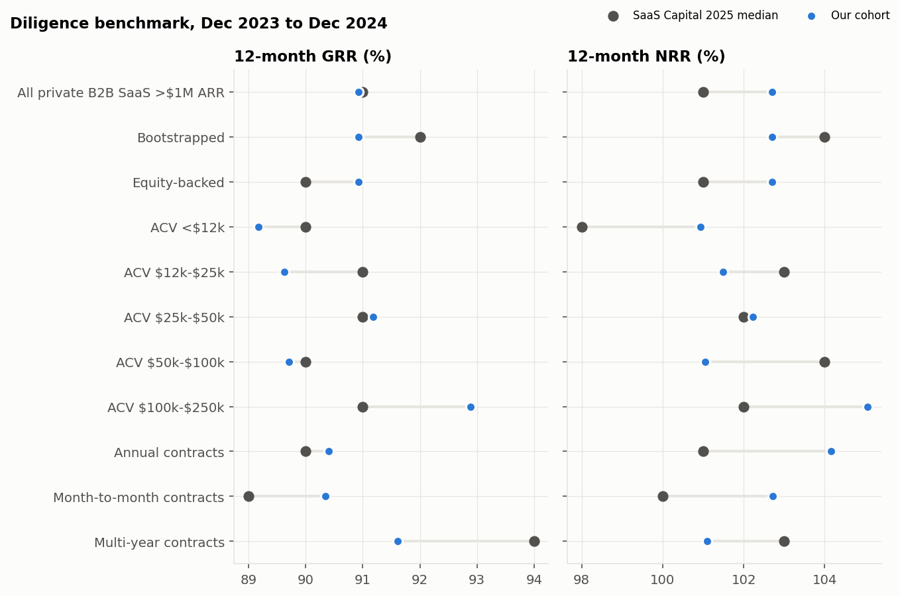
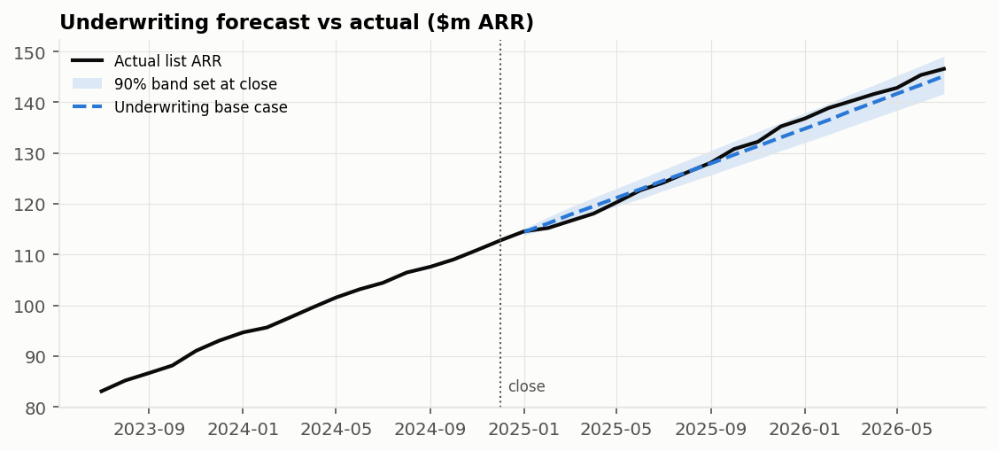
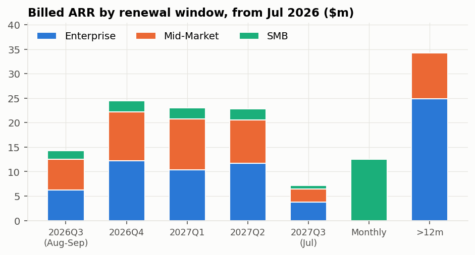
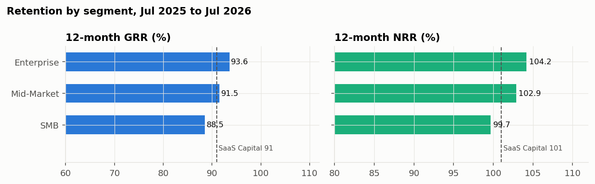
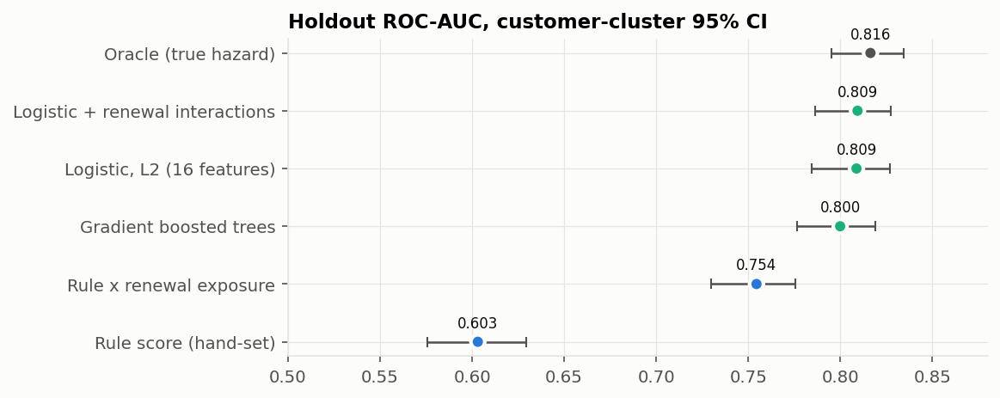
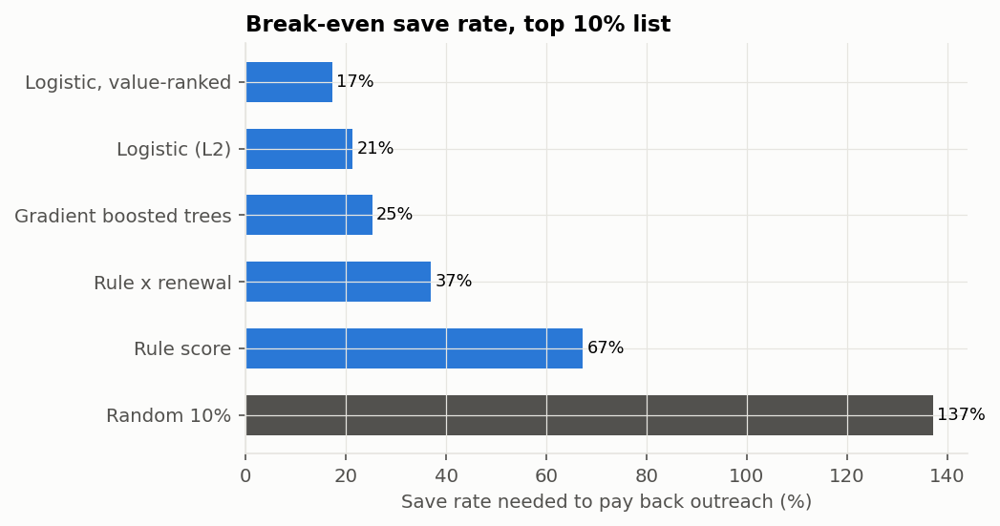

<div align="center">

# B2B SaaS Growth Quality and Churn Risk Analytics

An acquisition case on a B2B SaaS book: diligence at close, an underwriting forecast tested against what happened
next, and post-close monitoring of revenue quality and churn risk.


[Project report](reports/project_report.docx) · [Quality-of-revenue workbook](reports/quality_of_revenue.xlsx) · [Portfolio brief (PDF)](reports/portfolio_monitoring_brief.pdf) · [Dashboard](dashboard/index.html) · [Assumptions register](data/reference/simulation_assumptions.csv)

</div>

---

## The case

A formerly bootstrapped B2B SaaS company is acquired in December 2024 at about $113m of list ARR. The analysis is
split at the close:

1. Diligence (data to Dec 2024). Is growth bought with discounts? How do GRR and NRR compare with peers measured
   over the same window? How concentrated is ARR?
2. Underwriting. What does the book look like 19 months later, forecast from pre-close data only, and how wide
   should the range be?
3. Monitoring (Jan 2025 to Jul 2026). Did the plan hold? Where is revenue quality weakest now? Which accounts are
   at risk, and at what save rate does a retention programme pay back?

Customer-level data is synthetic, because account-level usage, discount, billing and support data is never public.
Its Dec 2023 to Dec 2024 retention is calibrated to SaaS Capital's 2025 survey, which measured the same window, so
agreement there is by design. Everything after the close is out of sample.

## Findings

| Area | Result | Reference point |
|---|---|---|
| Diligence retention | 12-month GRR 90.9%, NRR 102.7% (Dec 2023 to Dec 2024) | SaaS Capital 2025: 91% / 101% all, 92% / 104% bootstrapped |
| Growth | List ARR +21.2% in 2024, +19.9% in 2025, slowing as new-logo ARR stays flat | SaaS Capital revenue-growth medians: 23% / 25% (bootstrapped / equity-backed) in 2024, 20% / 25% in 2025 |
| Underwriting | Base case 1.0% below actual ARR after 19 months, never more than 1.7% off; actual inside the 90% band every month | Same band method covered 84% across 29 rolling origins, below 90% at 10 of 12 horizons |
| Retention after close | GRR ran 1.2 to 2.2 points above plan | Calendar 2025 GRR 92.5%, NRR 103.2% vs SaaS Capital bootstrapped 91% / 103% |
| Expansion mix | Expansion is 55% of gross new ARR over the last four quarters | Benchmarkit 2026 median 40% (denominator not stated; direction only) |
| Renewal exposure | $92m (66% of billed ARR) of committed ARR renews in the next 12 months; at least $6.4m expected lost | Last year's non-renewal rates by segment; excludes down-sell at renewal |
| Revenue to cash | 97% cash conversion; 1.4% of revenue never collected | DSO follows from a one-month terms assumption |
| Churn model | L2 logistic holdout ROC-AUC 0.809, +0.054 over the operating rule; gradient boosted trees 0.800 | Oracle ceiling 0.816 |
| Retention economics | Best list needs a 21% save rate to pay back (17% if ranked by expected MRR loss) | Pilot needs about 3,500 accounts per arm |
| Forward ARR | $170m by Jul 2027 (90% band $165m to $173m) | Downside $154m; no new logos $151m |

What the numbers say:

- At close the book sits at the benchmark median on GRR and between the all-company and bootstrapped medians on NRR. Matched by ACV band and contract term, the largest GRR shortfall is multi-year contracts; the largest NRR shortfall is the $50k to $100k band, and it comes from expansion rather than losses.
- The underwriting base case stayed within 1.7% of actual ARR for 19 months. Tested across rolling origins, the 90% band is too narrow at most horizons (79% coverage one month ahead, 70% to 79% at ten to twelve months), because drawing months independently ignores how good and bad months cluster and trailing rates lag a rising new-logo trend.
- Post-close retention beat plan by 1 to 2 points for eight straight months. The simulator's parameters are fixed after close, so the beat says the plan was conservative, not that the business improved; the right response is to re-base the plan at about 92%.
- Churn risk is concentrated in time: accounts inside a renewal window or on monthly terms are 46% of account-months but 88% of churn. L1, L2 and Elastic Net tie on accuracy and agree on the strong features; L2 wins the pre-set tie-break because about 96 churn events per feature leave no need to drop features and L1's choice among weak features changes with the sample. Gradient boosted trees and explicit renewal interactions added nothing, because the simulated churn mechanism is close to additive.
- SMB loses revenue through lost logos rather than down-sell, and raises about 11 times more support tickets per dollar of ARR than Enterprise; retention alone does not argue for shrinking it, cost to serve and CAC would.
- A retention programme looks fundable only with a good list, and one company cannot test the save rate in a useful time. A pilot pooled across portfolio companies is the realistic design.

## Quality-of-revenue workbook

`reports/quality_of_revenue.xlsx` holds the analysis in Excel with live formulas. Blue cells are data or inputs,
black cells are formulas, green cells link across sheets, yellow cells are the assumptions most worth challenging.

| Sheet | Contents |
|---|---|
| Cover | Purpose, evidence boundary, units, colour legend, checks |
| Summary | Headline KPIs, each linked to its working sheet |
| Inputs | Assumptions and cited benchmarks with window, sample and scope |
| Diligence | Dec 2023 to Dec 2024 cohort vs SaaS Capital 2025 by ACV band, contract term and funding type |
| Plan_vs_Actual | Underwriting base case and band set at close vs actual ARR; retention plan vs actual |
| ARR_Bridge | Quarterly ARR roll-forward, quick ratio, expansion share, growth |
| Retention | 12-month cohort retention now; monthly-compounding reconciliation |
| Concentration | Top-N share, HHI, trend, top 20 accounts |
| Revenue_to_Cash | Revenue, invoicing, collections, receivables, DSO, failed collections |
| Renewals | ARR by renewal quarter and expected ARR lost |
| Sensitivity | Forward ARR across GRR and expansion; value of one point of GRR |
| Customer_ARR | Account-level ARR at July 2026 |
| Monthly_Bridge | Monthly list-MRR bridge from SQL |

Three reconciliation checks must read zero: the ARR bridge roll-forward, the receivables roll-forward, and invoices
equal to recognized revenue.

<p align="center">
  
  
</p>

<p align="center">
  
  
</p>

<p align="center">
  
  
</p>

## How the numbers are produced

```text
Synthetic operating data: 4,547 accounts, Jan 2022 to Jul 2026, six tables, eight planted defect classes
    |
    +--> data-quality ledger scored against the planted defects --> repair or quarantine
    |
    +--> SQLite marts: account-month, cohort retention, MRR bridge, discount dependence
    |
    +--> diligence at close (Dec 2024): matched benchmarks, concentration, discount dependence
    |
    +--> underwriting forecast from pre-close data --> compared with 19 post-close months
    |
    +--> churn scoring: trained before close, tested after; rule, logistic (L1/L2/Elastic Net), boosted trees
    |
    +--> break-even save rate, pilot sizing, forward scenarios
    |
    +--> workbook, PDF brief, dashboard, project report
```

## Controls

| Control | How it is enforced |
|---|---|
| Data quality | Every planted defect is detected exactly; values are repaired only when billed = list x (1 - discount) reconstructs them. |
| Reconciliation | The SQL MRR bridge identity ties to the cent and its churn component matches an independent pandas computation; the workbook re-checks roll-forwards. |
| Comparable definitions | Retention is annual, per customer, on the cohort active a year earlier, the definition SaaS Capital uses; benchmarks are matched by window, ACV band and contract term. |
| Out of time | Models train on labels that matured by the close and are tested only on post-close months; the forecast uses pre-close data only. A test checks that changing post-close data leaves the forecast unchanged. |
| Honest uncertainty | Customer-cluster bootstrap with paired draws for model differences; interval coverage tested at every rolling origin. |
| Test suite | 23 automated tests covering quality, leakage, SQL reconciliation, revenue-to-cash, models, bootstrap, economics and underwriting. |

## Repository

| Location | Contents |
|---|---|
| `reports/project_report.docx` | Full report: executive summary, definitions of every metric and technique, and a 20-step end-to-end analysis with a reflection on each step |
| `reports/quality_of_revenue.xlsx` | Formula-driven quality-of-revenue workbook |
| `reports/portfolio_monitoring_brief.{md,pdf}` | Investment-committee style brief |
| `dashboard/index.html` | Static dashboard |
| `outputs/figures/` | Charts used in the report and dashboard |
| `docs/` | Methodology and public-comparables notes |
| `data/reference/` | Benchmark table (with measurement windows) and the assumptions register |

The code (Python, SQL, tests) and the generated data are kept private and are available on request.
